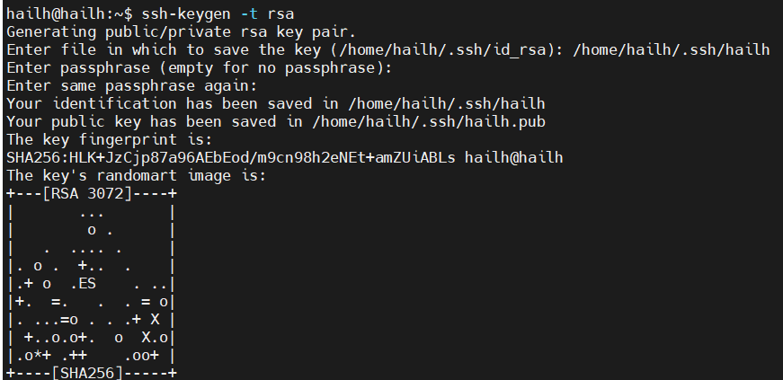

# SSH
1. `ssh-keygen -t rsa` tạo ssh key
- ` -t rsa` sử dụng thuật toán rsa 
2. `Enter file in which to save the key (/home/hailh/.ssh/id_rsa): ` chọn nơi lưu key
3. `Enter passphrase (empty for no passphrase):` nhập mật khẩu 

- `hailh` private key 
- `hailh.pub` public key

4. `ls -al ~/.ssh` kiểm tra xem đã tạo thành công chưa 

