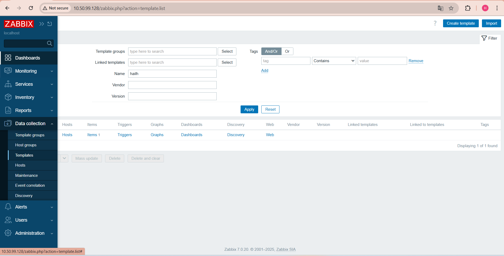
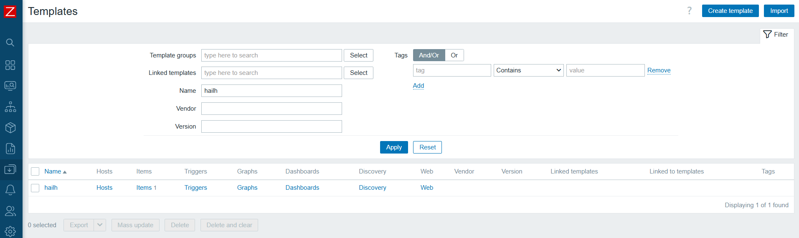
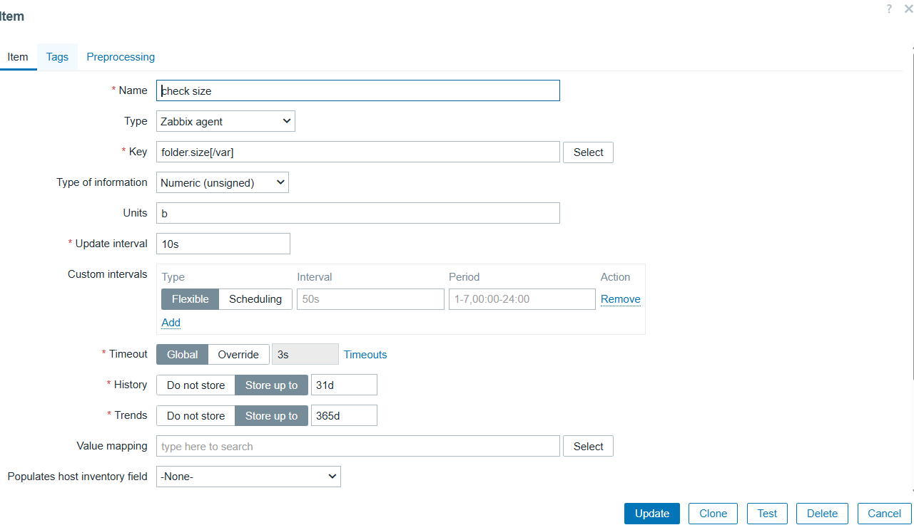
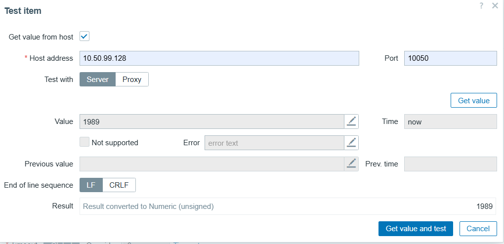
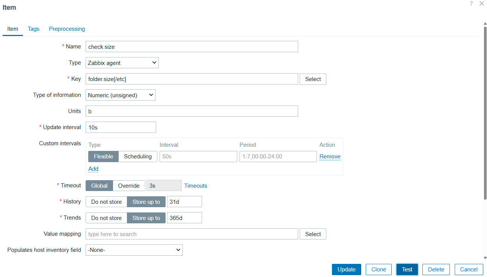
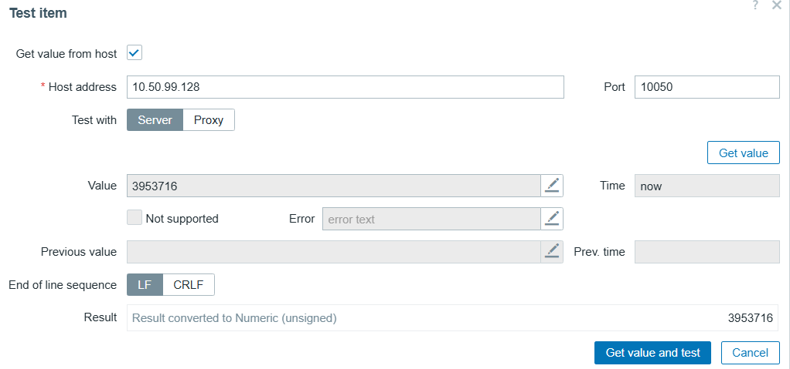

# tạo template theo yêu cầu 
- thực hiện tạo template để kiểm tra dung lượng của folder và file
## 1. tạo teplate 
trong zabbix fontend chọn `data colection` chọn `templates` chọn `create templates`
 
   

## 2. chạy lệnh trên server cài zabbix agent để kiểm tra dung lượng file 

syntax:

`stat -c%s "/etc" 2>/dev/null || echo 0`

output:
```
devops@node3:~$ stat -c%s "/etc/passwd" 2>/dev/null || echo 0
1989
```
## 3 tạo Flexible User parameter 
- tạo file cấu hình của zabbix agent 

`/etc/zabbix/zabbix_agentd.d/check_size.conf`
- thêm dòng `User Parameter` 

`UserParameter=file.size[*],stat -c%s "$1" 2>/dev/null || echo 0`
 
`file.size[*]` dynamic key cho phép truyền đường dẫn file 

`stat -c%s "$1"` để lấy kích thước file 

`2>/dev/null`nếu file ko tồn tại thì không in ra thông báo lỗi 

## 4. tạo item cho templates

  

- đến templates vừa tạo nhấn vào item rồi chọn `Create item`

   

- điền các giá trị như hình trên 
- `name` : `check size`
- `type` : `zabbix agent`
- `key` : ` file.size[/etc/passwd"]` sử dụng `key item` là  ` filer.size[/etc/passwd"]` và truyền tham số (đường dẫn file) để đo dung lượng file 
- `Type of information` : `numberric` 
- sau đó nhấn test nhập ip của host và port để kiểm tra 

  

- kết quả cho thấy file `/etc/passwd` có 1989 byte 

## 6. thử với folder 
- mở file cấu hình zabbix agent 

`/etc/zabbix/zabbix_agentd.d/check_size.conf`
- thêm dòng `User Parameter` 

`UserParameter=folder.size[*],du -sb "$1" 2>/dev/null | cut -f1`

`folder.size[*]` dynamic key cho phép truyền đường dẫn folder

`du -sb "$1"` 
  - `du` để đo dung lượng thư mục 
  - `-s` chỉ tổng dung lượng ko liệt kê file 
  - `b` tính theo bytes
  - `$1` tham số chuyền vào zabbix 
  - `2>/dev/null`nếu folder ko tồn tại thì không in ra thông báo lỗi
  - `cut -f1` cắt lấy trường đầu tiên (ở đây là bytes) 

 đến templates vừa tạo nhấn vào item rồi chọn `Create item`

   

điền các giá trị như hình trên 
- `name` : `check size`
- `type` : `zabbix agent`
- `key` : ` folder.size[/etc"]` sử dụng `key item` là  ` foler.size[/etc"]` và truyền tham số (đường dẫn folder) để đo dung lượng folder
- `Type of information` : `numberric` 
- sau đó nhấn test nhập ip của host và port để kiểm tra 

  
- kết quả cho thấy folder `/etc` có 3953716 bytes
