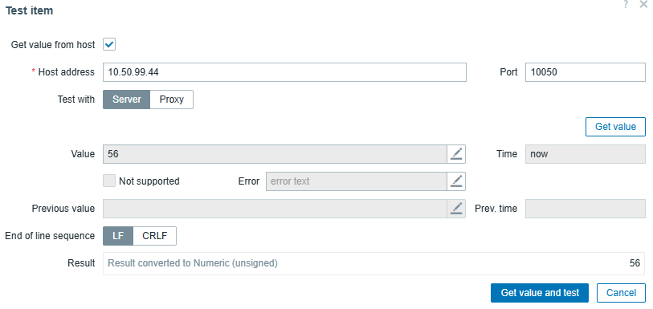
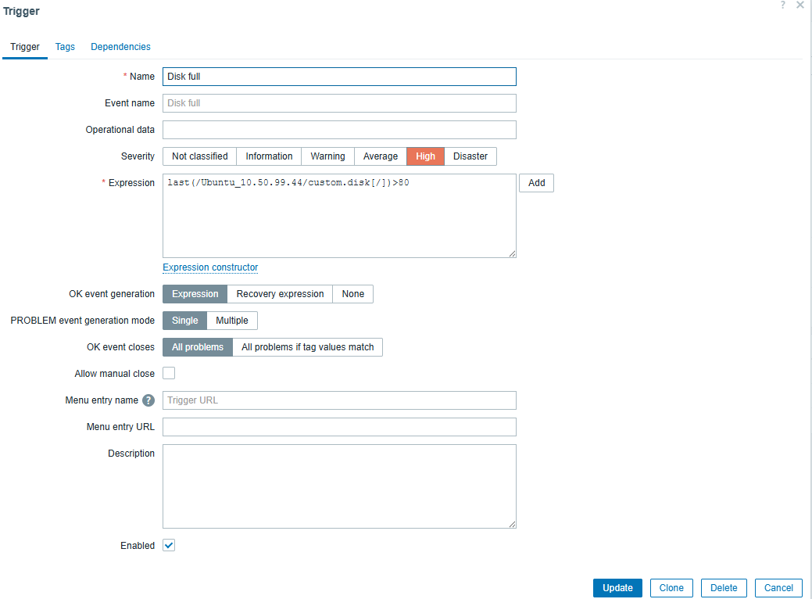
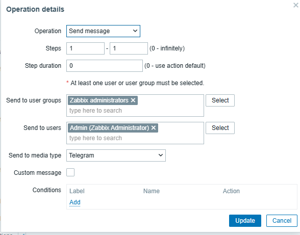

# monitor cho 2 server 
1. cài zabbix và zabbix agent cho 2 server 
```
wget https://repo.zabbix.com/zabbix/6.0/ubuntu/pool/main/z/zabbix-release/zabbix-release_6.0-4+ubuntu20.04_all.deb
sudo dpkg -i zabbix-release_6.0-4+ubuntu20.04_all.deb
sudo apt update 
sudo apt install zabbix-agent 
```
2. cấu hình zabbix-agent 
- `sudo vi /etc/zabbix/zabbix_agentd.conf`
- sửa các dòng này 
```
server=10.50.99.128
serverActive=10.50.99.128
Hostname=tên_server 1,2
```
- thêm userparameter cho những thứ mà mình muốn monitor
```
UserParameter=custom.disk[*],/usr/local/bin/check_disk.sh $1
UserParameter=custom.cpu[*],/usr/local/bin/check_cpu.sh $1
UserParameter=custom.mem[*],/usr/local/bin/check_mem.sh $1
UserParameter=custom.net[*],/usr/local/bin/check_net.sh $1 $2
```
3. viết script cho các userparameter
- script cho disk
```
sudo nano /usr/local/bin/check_disk.sh
MOUNT=$1
if [ -z "$MOUNT" ]; then
    echo "0"
    exit 1
fi
df -P "$MOUNT" | awk 'NR==2 {print $5}' | tr -d '%'
```
- script cho cpu
```
sudo nano /usr/local/bin/check_disk.sh
METRIC=$1
case $METRIC in
    load) awk '{print $1}' /proc/loadavg ;;
    idle) mpstat 1 1 | awk '/all/ {print $12}' ;;
    *) echo "0" ;;
esac

```
- script cho memory
```
sudo nano /usr/local/bin/check_mem.sh
METRIC=$1
case $METRIC in
    total) free -m | awk '/Mem:/ {print $2}' ;;
    used) free -m | awk '/Mem:/ {print $3}' ;;
    free) free -m | awk '/Mem:/ {print $4}' ;;
    *) echo "0" ;;
esac
```
- script cho network 
```
sudo nano /usr/local/bin/check_net.sh
IF=$1
DIR=$2

if [ ! -d /sys/class/net/$IF ]; then
    echo 0
    exit 0
fi

RX_FILE="/sys/class/net/$IF/statistics/rx_bytes"
TX_FILE="/sys/class/net/$IF/statistics/tx_bytes"

if [ "$DIR" == "in" ]; then
    if [ -f "$RX_FILE" ]; then
        cat $RX_FILE
    else
        echo 0
    fi
else
    if [ -f "$TX_FILE" ]; then
        cat $TX_FILE
    else
        echo 0
    fi
fi
```
- phân quyên cho các script
- `sudo chmod +x /usr/local/bin/check_*.sh`
3. khởi động service
```
sudo systemctl restart zabbix-agent
sudo systemctl enable zabbix-agent
```
4. vào zabbix server tạo host group và host cho 2 server 
- vào zabbix - datacolection - host group - create host group đặt tên cho host group `unicloud_dev`
- trong datacolection - host -create host 

   

- tên host để `hostname_ip`
- template ta add các template (ví dụ: Apache by Zabbix agent, MySQL by Zabbix agent ...)
- host group ta add group mà ta vừa tạo ở trên 
5. tạo item và trigger cho host 
- tạo items

  

- đặt tên item
- type chọn `zabbix agent`
- điền key đã khai báo `custom.disk[/]`
- host interface`ip của server`

- test 
  

- disk của server đã 56%

- tạo trigger 
  
  
  - đặt tên triger 
  - severity chọn mức cảnh báo 
  - Expression add item vừa tạo 
6. tạo trigger và import mediatypes
- tạo trigger action 
  - đặt tên trigger action 
  - Conditions 
  
   

   - type chọn host group 
   - select hostgroups đã tạo và add các host đã tạo vào group đó 

   

   - operation chọn `send message`
   - send to user groups `zabbix administators` 
   - send to user `admin`
- import media type  có sẵn`https://git.zabbix.com/projects/ZBX/repos/zabbix/browse/templates/media/telegram/media_telegram.yaml?at=7.0.21`

7. add media type 
- add media type vào user đã add ở trong trigger action và thêm chat id để khi trigger cảnh báo alert về telegram 
8. test xem khi trigger cảnh báo và không cảnh báo đã alert về tele chưa

   

- trigger cảnh báo khi disk quá 50%
   
   

- trigger hết cảnh báo khi disk dưới 50%..


