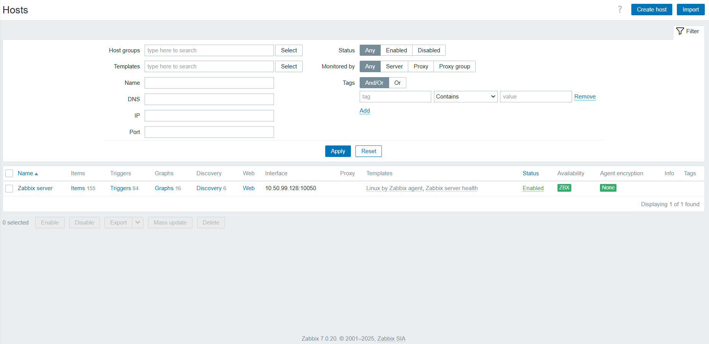

# setup Zabbix và cấu hình 
## 1. cài đặt 
- cài đặt kho lưu trữ zabbix 
`wget https://repo.zabbix.com/zabbix/7.4/release/ubuntu/pool/main/z/zabbix-release/zabbix-release_latest_7.4+ubuntu24.04_all.deb` 
- cài đặt các gói đã tải xuống bằng `dpkg`
- `dpkg -i zabbix-release_latest_7.4+ubuntu24.04_all.deb`
- `sudo apt update`
- cài đặt máy chủ zabix và giao diện người dùng 
- ` sudo apt install zabbix-server-mysql zabbix-frontend-php zabbix-nginx-conf zabbix-sql-scripts zabbix-agent`
## 2. tạo database, user và cấp quyền  cho zabbix
- `sudo mysql`
- `create database zabbix character set utf8mb4 collate utf8mb4_bin;`tạo database có tên là zabbix 
- `create user zabbix@localhost identified by 'password123';` tạo user password 
- `grant all privileges on zabbix.* to zabbix@localhost;` cấp full quyền cho user 
- `FLUSH PRIVILEGES` 
- `exit`
- Import database
- `zcat /usr/share/zabbix/sql-scripts/mysql/server.sql.gz | mysql --default-character-set=utf8mb4 -uzabbix -p zabbix`
- cấu hình database cho máy chủ zabbix 
```
DBhost=localhost 
DBName=zabbix
DBuser=zabbix
DBpassword=password123
```
- `dbhost= localhost` cài trên cùng 1 host với zabbix server
- `dbname` tên của database
- `dbusser` tên của user database 
- `dbpassword` password của user database
- khởi động các tiến trình máy chủ zabbix 
- `sudo systemctl restart zabbix -server`

- sau đó mở trang web zabbix 

## 3. tạo item 
- item được sử dụng để thu thập dữ liệu như cpu , ram ,disk  sau khi mình đã thêm host , bạn cần phải thêm các item để thu nhập dữ liệu thực tế từ host đã thêm đó 
- tạo item mới 1 iyem với item key là `wordpress.status` để kiểm tra xem wordpress có hoạt động ko 
- để tạo `item` mới trên zabbix 
   - đi đến `data collection` chọn `hosts`
   - chọn `item` thuộc hosts cần tạo 

  

- xong chọn `create item` 
- nhập thông số vào `item`

   

- nhập thông số xong nhấn `add` 
- vậy là chúng ta đã tạo xong `item` 
- để đặt cảnh báo ta cần tạo `trigger`
## 4. tạo trigger 
- trigger là điều kiện logic mà zabbix dùng để phát hiện sự cố từ dữ liệu (item) thu thập được 
- item thu nhập dữ liệu , còn trigger quyết định khi nào dữ liệu đó bất thường 
- để tạo `trigger` mới trên zabbix 
  - đi đến `data collection` chọn `hosts`
  - chọn `trigger` thuộc `hosts` cần tạo 

   

- đặt tên cho `trigger` chọn mức độ 
- viết Expression để cánh báo  `last(/Zabbix server/wordpress.status)<>200`
- `last(...)` hàm trả về giá trị cuối cùng của 1 item trong zabbix 
- `/Zabbix server` tên host trong zabbix
- `/wordpress.status` key của item 
- `<>200` nếu web trả về 200 là hoạt động bình thường còn nếu web trả về khác 200 là web lỗi trigger sẽ cảnh báo 
 