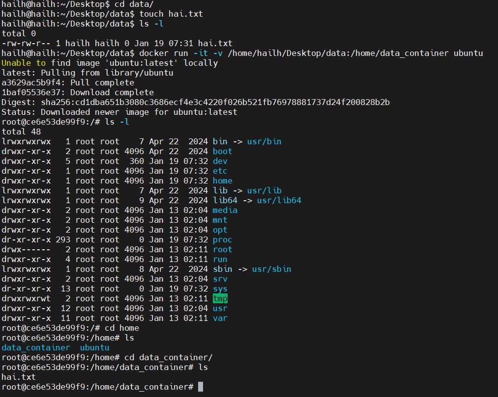
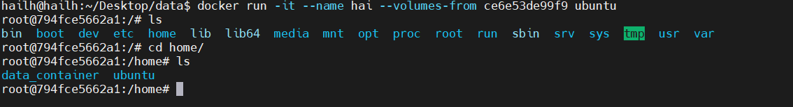
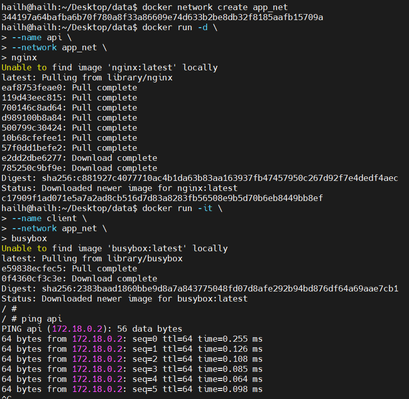

# docker 
- docker là một công cụ giúp ta tương tác với công nghệ container ở bên dưới , chứ nó không phải là container . đúng hơn docker là một tool giúp ta tương tác với container một cách dễ dàng thay vì ta phải làm nhiều thứ . và docker sẽ tương tác với container bên dưới thông qua container runtime 
- container là 1 công nghệ cho phép các ứng dụng được đóng gói và cô lập với toàn bộ môi trường chạy thực tế của chúng . diều này giúp dễ dàng duy trì nhất quán trong khi di chuyển ứng dụng được chứa giữa các môi trường (phát triển , thử nghiệm sản xuất ) và trên các nên tảng đám mây công cộng , riêng tư , lai và tại chỗ . nhờ tính nhẹ và di động , container mang đến cơ hội phát triển nhanh hơn và đáp ứng các nhu cầu kinh doanh ngay khi chúng phát sinh
## commands 
- `docker run` bắt đầu container
- `docker run -it` bắt đầu 1 vùng chứa tương tác 
- `docker run -d` bắt đầu 1 container tách rời 
- `docker ps` liệt kê các container đang chạy 
- `docker stop` dừng container
- `docker run --name <container-name> <image-name >` băt dầu vùng chứa bằng 1 tên 
- `docker ps -f "name=<container-name>` lọc container đang chạy theo tên 
- `docker logs <container-id>` xem nhật ký hiện có của vùng chứa 
- `docker logs -f <container-id>` xem nhật ký trực tiếp cho cùng chứa 
- `docker container rm <container-id>` loại bỏ container đã dừng 
- `docker pull <image >` kéo 1 hình ảnh 
- `docker pull <image_name>:<image_version>` kéo 1 phiên bản cụ thể của 1 hình ảnh 
- `docker images` liệt kê tất cả images
- `docker image rm` xóa hình ảnh 
- `docker container prune` loại bỏ tất cả các container đã dừng 
- `docker image prune -a` xóa tất cả hình ảnh 
- `docker volume` 
- `docker volume create <volume_name>`
- `docker volume ls` 
- `docker volume inspect` `
- `docker logs <container_name_or_id>` Xem log container
- `docker inspect <container>` Kiểm tra thông tin chi tiết container
- `docker stats` Theo dõi tài nguyên container
- `docker exec [options] <container> <command>` Truy cập vào container đang chạy
- `docker volume rm volume_name volume_name` xóa volume 
1. Docker Client
- Docker Client là công cụ dòng lệnh (CLI) mà bạn sử dụng hằng ngày
  - Nhận lệnh từ người dùng
  - Gửi lệnh đó tới Docker Host
  - Không trực tiếp chạy container
2. Docker Host 
- Docker Host là máy tính / server nơi
  - Docker Engine đang chạy 
  - Containers thực sự được tạo và chạy
- Docker Host gồm :
  - docker daemon 
  - image 
  - container 
  - network 
  - volumes
- nhiệm vụ 
  - nhận lệnh từ docker client 
  - thực hiện các thao tác như: pull image , tạo container , chạy hoặc dừng container 
3. Docker Registry
- Docker Registry là kho lưu trữ Docker Images
- các loại Registry 
  - Public Registry: Docker Hub
  - Private Registry : Harbor, GitLab Registry
4. luồng hoạt động : docker pull
- Docker Client gửi lệnh pull nginx
- Docker Daemon kiểm tra xem image nginx có trên host chưa
- nếu chưa có docker host kết nối tới dockerhub và tải image về 
- image được lưu vào docker host
5. luồng hoạt động : docker run
- `docker run -d -p 80:80 nginx`
- Docker Client gửi lệnh run nginx
- Docker Daemon kiểm tra
- image nginx có tồn tại chưa 
- nếu chưa có tự động có image tự động thực hiện `docker pull nginx `
- docker daemon 
  - tạo container từ image 
  - cấp : filesystem , network , port
- container được chạy 
6. Chạy container ở chế độ nền (Detached Mode -d) 
- `docker run -d nginx`
- container chạy ngầm , không chiếm terminal dùng cho : web server , database , backend service 
7. Chạy container tương tác trực tiếp (-it)
- `-i` interactive
- `-t` cấp pseudo-TTY
8. Layer Caching
- Docker cache lại kết quả của từng layer.
- khi build lại 
  - Nếu layer không thay đổi -> Docker dùng lại cache
  - Nếu layer thay đổi -> Docker build lại layer đó và các layer phía sau
9. Multi-stage Build
- Multi-stage Build cho phép:
 - Dùng nhiều FROM trong một Dockerfile
 - Mỗi FROM là một stage
 - Chỉ copy artifact cần thiết từ stage trước sang stage sau
 - Không mang theo tool build, source code, package thừa
 10. Sự khác biệt giữa Bind Mounts và Volumes
 - Bind Mount:
   - Map thư mục / file cụ thể trên Host
   - Vào đường dẫn trong container
- ưu điểm 
  - Dễ dùng , Phù hợp development , Realtime sync
- nhược điểm 
  - Phụ thuộc cấu trúc thư mục host , Dễ lỗi permission , ít portable , kém an toàn 
- Volumes: 
 - Docker quản lý hoàn toàn 
- ưu điểm 
  - An toàn , Portable , dễ backup/restore , chuẩn production , ít lỗi permission 
- nhược điểm 
  - không thấy trực tiếp file , không realtime nhu Bind mount 
11. Cách chia sẻ dữ liệu giữa máy host và container.
- `docker run -it -v /home/hailh/Desktop/data:/home/data_container ubuntu` tạo container từ image ubuntu và nhận dữ liệu chia sẻ là thư mục data của máy host
- `/home/hailh/Desktop/data` đường dẫn đến thư mục chứa dữ liệu trên máy host để chia sẻ 
- `/home/data_container` đường dẫn đến thư mục chứa dữ liệu trên container 
- `ubuntu` image ubuntu dùng để tạo ra container 



12. Chia sẻ dữ liệu giữa 2 container
- `docker run -it --name hai --volumes-from ce6e53de99f9 ubuntu` tạo container tên là hai từ image ubuntu và được chia sẻ dữ liệu từ container ce6e53de99f9



13. Docker Networking
- Docker Network cho phép :
  - container giao tiếp với nhau 
  - container giao tiếp với host / internet 
  - cách ly network giữa các nhóm container 
14. Container kết nối với nhau qua tên
- Docker có DNS server nội bộ: Chỉ hoạt động trong custom bridge , Tự động ánh xạ 
- ví dụ :

- `docker network create app_net` tạo network 
- chạy backend 

```
docker run -d \
  --name api \
  --network app_net \
  nginx
```

- Chạy frontend

```
docker run -it \
  --name client \
  --network app_net \
  busybox
```



15. Truyền biến môi trường cho container 
- Biến môi trường dùng để: Config app , tránh hard-code trong image , phân biệt dev/staging/prod
- `-e` : ít biến , test nhanh , lộ biến khi xem docker ps 
- `.env` gọn ,dẽ quản lý , không lộ trên commandline 
16. docker compose 
- docker compose dùng để : định nghĩa nhiều container trong 1 file Yaml 
- quản lý toàn bộ stack : start , stop , scale , network , volume 
- các lệnh docker compose :
  - `docker compose up` build image , tạo network , volume , start toàn bộ service 
  - `docker compose down ` stop và remove container , network 
  - ` docker ccompose build` build image theo `build:` trong compose , không start container 
  - `docker compose logs ` xem log tất cả service 
17. thiết lập phụ thuộc giữa các service 
- `depends_on` đảm bảo rằng 1 container khởi động trước 1 container khác 
- hạn chế : không đảm bảo rằng cơ sở dữ liệu đã săn sàng nhận kết nối . điều này có thể dẫn đến tình trạng ứng dụng của bạn cố gắng kết nối tới cơ sở dữ liệu trước khi nó thực sự săn sàng , gây ra lỗi kết nối 
-  `wait-for-it.sh ` 1 script shell nhẹ giúp 1 dịch vụ chờ đợi cho đến khi 1 dịch vụ khác có thể kết nối 
- tại sao nên chọn : ngăn chặn các điều kiện đua như ứng dụng bị sập khi khơi động , hoạt động với bất kỳ dịch vụ nào ,đơn giản , dễ vẫn chuyển và tránh logic thử lại phức tạp trong mã ứng dụng 
- thực tiễn tốt nhất : 
  - luôn sử dụng `wait-for-it.sh` hoặc 1 phương pháp tương tự để đảm bảo rằng dịch vụ của mình đã sẵn sàng trước khi khởi động ứng dụng 
  - kết hợp `depends_on` và `wait-for-it.sh` để có sự khởi động và sẵn sàng dịch vụ tối ưu nhất 
- hiệu suất
  - sử dụng các health checks trong docker để xác định trạng thái dịch vụ 1 cách chính xác hơn 
  - giảm nhiều số lượng dịch vụ phụ thuộc vào nhau để tăng tốc khởi động 
 


