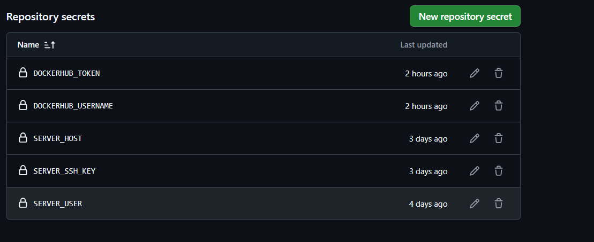
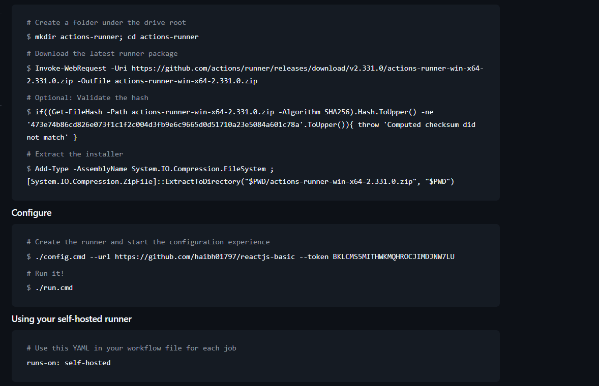
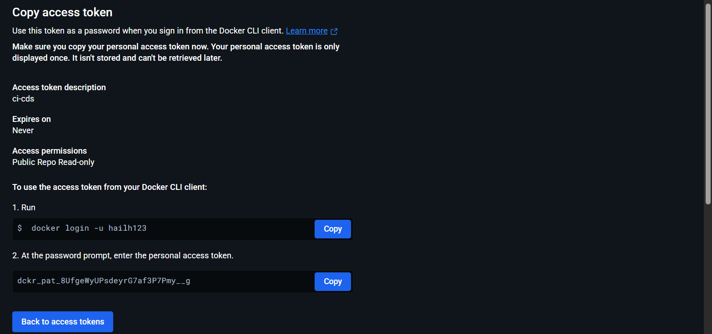
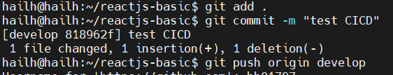
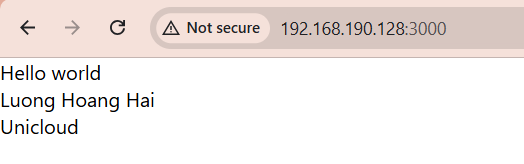

1.  tạo thư mục project
- `npx create-react-app reactjs-basic`
- `cd reactjs-basic` 
- `npm npm start`
2.  tạo dockerfile 

```
FROM node:18-alpine as build
WORKDIR /app
COPY package*.json ./
RUN npm install
COPY . .
RUN npm run build

FROM nginx:alpine
COPY --from=build /app/build /usr/share/nginx/html
EXPOSE 80
CMD ["nginx", "-g", "daemon off;"]
```
- `WORKDIR /app` tạo thư mục `/app` trong container 
- `COPY package*.json ./` docker sẽ cache layer này 
   - nếu code thay đổi nhưng `package*.json` không đổi thì `npm install` không chạy lại sẽ giúp build nhanh hơn 
- `RUN npm install` cài toàn bộ dependency trong  `package*.json`
- `COPY . .` coppy toàn bộ source code vào trong container . đặt sau npm install để tận dụng cache 
- `COPY --from=build /app/build /usr/share/nginx/html` 
   - coppy kết quả build từ stage build 
   - đưa vào thư mục Nginx 
- `CMD ["nginx", "-g", "daemon off;"]` lệnh chạy khi container start 
3.  cấu hình `.gitignore`

```
node_modules
build
actions-runner
.env
*.log
*.tar.gz
```

- `node_modules` nếu ko có `.gitignore`
  - coppy hàng nghìn file vào image 
  - image to 
  - build chậm 
- `build` nếu ko có `.gitignore` 
  - có thể : gây lỗi version , làm imag to 
  - build phải sinh ra trong docker , khong dùng build local
- `actions-runner` nếu ko có `.gitignore` 
  - lộ token runner 
  - lộ config 
- `.env`
  - có thể chứa : API URL nội bộ , token , key 
- `*.log` nếu ko có `.gitignore` 
  - ko có giá trị khi build image 
4. tạo file deloy.yml

```
name: React Auto Deploy (Self Hosted)

on:
  push:
    branches:
      - develop

jobs:
  build_and_deploy:
    runs-on: self-hosted

    steps:
      # 1. Checkout source
      - name: Checkout code
        uses: actions/checkout@v4

      # 2. Login Docker Hub
      - name: Login to Docker Hub
        uses: docker/login-action@v3
        with:
          username: ${{ secrets.DOCKERHUB_USERNAME }}
          password: ${{ secrets.DOCKERHUB_TOKEN }}

      # 3. Build & Push image
      - name: Build and push Docker image
        uses: docker/build-push-action@v5
        with:
          context: .
          push: true
          tags: hailh123/reactjs-basic:latest

      # 4. Deploy (local docker, KHÔNG SSH)
      - name: Deploy container
        run: |
          docker pull hailh123/reactjs-basic:latest
          docker stop reactjs-container || true
          docker rm reactjs-container || true
          docker run -d \
            --restart unless-stopped \
            -p 3000:80 \
            --name reactjs-container \
            hailh123/reactjs-basic:latest
```

```
on:
  push:
    branches:
      - develop
```
- chỉ chạy khi push lên branch develop

```
- name: Checkout code
  uses: actions/checkout@v4
```
- clone soure code từ repo git về máy runner

```
- name: Login to Docker Hub
        uses: docker/login-action@v3
        with:
          username: ${{ secrets.DOCKERHUB_USERNAME }}
          password: ${{ secrets.DOCKERHUB_TOKEN }}
```
- login docker hub bằng secret
- cho phép push image 

``` 
 - name: Build and push Docker image
        uses: docker/build-push-action@v5
        with:
          context: .
          push: true
          tags: hailh123/reactjs-basic:latest
```
- ` context: .`
  - Docker build tại thư mục hiện tại
  - Dockerfile nằm ở root project
- `push: true`
  - Sau khi build xong:
  - push image lên Docker Hub
- `tags: hailh123/reactjs-basic:latest` tên image 

```
- name: Deploy container
        run: |
          docker pull hailh123/reactjs-basic:latest
          docker stop reactjs-container || true
          docker rm reactjs-container || true
          docker run -d \
            --restart unless-stopped \
            -p 3000:80 \
            --name reactjs-container \
            hailh123/reactjs-basic:latest
```
 - `docker pull hailh123/reactjs-basic:latest`
   - kéo image mới nhất từ docker hub 
   - ghi đè image cũ nếu có
- `docker stop reactjs-container || true`
   - stop container đang chạy 
- `docker rm reactjs-container || true`
  - xóa container cũ 
  - tránh lỗi khi run lại 

```
docker run -d \
  --restart unless-stopped \
  -p 3000:80 \
  --name reactjs-container \
  hailh123/reactjs-basic:latest
```
- `-d` chạy background 
- `--restart unless-stopped ` reboot server -> container tự chạy 
- `--name reactjs-container` tên container

5. tạo secret 



6.  tạo Self-hosted Runner



7. tạo token trên dockerhub 

 

8. commit và push code lên git 



- push code lên github 
- github actions chạy trên server 
- docker build và restart app tự động 

9. test 




