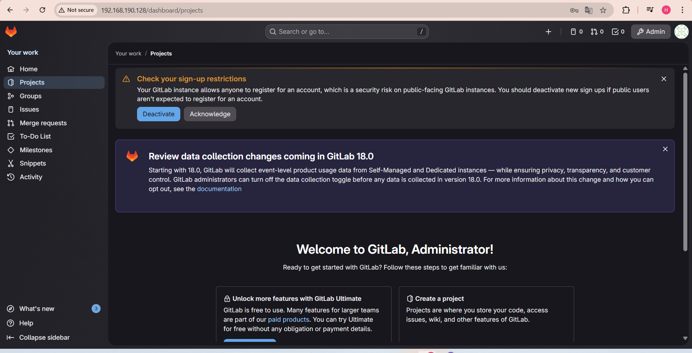
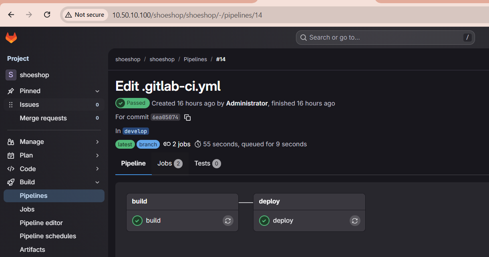
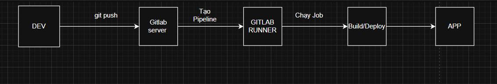
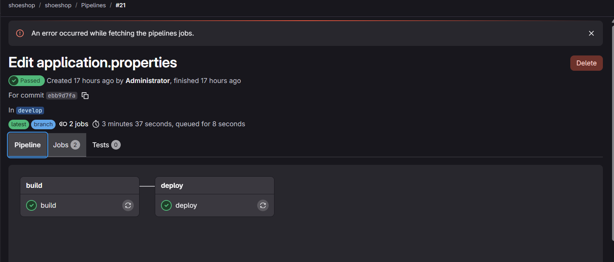

1. install gitlab
- `sudo apt update` 
- `curl -s https://packages.gitlab.com/install/repositories/gitlab/gitlab-ee/script.deb.sh | sudo bash`
- ` sudo apt install gitlab-ee -y`
- mở file cấu hình domain /ip
- `sudo nano /etc/gitlab/gitlab.rb` 
- ` external_url 'http://IP_SERVER_HOẶC_DOMAIN'`
- apply cấu hình 
- `sudo gitlab-ctl reconfigure`



2. tạo project 


- git setup 
  - `git config --local user.name "Administrator"`
  - `git config --local user.email "gitlab_admin_407715@example.com"`
- create repo 
  - `git clone http://10.50.10.100/shoeshop/shoeshop.git`
  - `cd shoeshp`
3. install gitlab-runner 
- `curl -fsSL https://packages.gitlab.com/install/repositories/runner/gitlab-runner/script.deb.sh | sudo bash`
- `sudo apt update`
- `sudo apt install gitlab-runner -y` 

4. tạo file .gitlab-ci.yml 

```
stages:
  - build
  - deploy

variables:
  APP_NAME: shoeshop
  APP_PORT: 8088
  DEPLOY_DIR: /home/gitlab-runner/shoeshop

build:
  stage: build
  tags:
    - shell
  script:
    - echo "=== BUILD SPRING BOOT ==="
    - mvn clean package -DskipTests
  artifacts:
    paths:
      - target/*.jar
    expire_in: 1 hour
  only:
    - develop

deploy:
  stage: deploy
  tags:
    - shell
  script:
    - echo "=== DEPLOY APPLICATION ==="
    - mkdir -p ${DEPLOY_DIR}
    - pkill -f app.jar || true
    - cp target/*.jar ${DEPLOY_DIR}/app.jar
    - nohup java -jar ${DEPLOY_DIR}/app.jar --server.address=0.0.0.0 --server.port=${APP_PORT} > ${DEPLOY_DIR}/app.log 2>&1 &
    - sleep 5
    - ss -lntp | grep ${APP_PORT} || true
    - echo "APP STARTED"
  only:
    - develop

```

```
stages:
  - build
  - deploy
```

- pieline có 2 giai đoạn 
  1. build 
  - compile code 
  - đóng gói thành file .jar
  2. deploy 
  - coppy file .jar sang thư mục deploy
  - chạy ứng dụng spring boot 

```
variables:
  APP_NAME: shoeshop
  APP_PORT: 8088
  DEPLOY_DIR: /home/gitlab-runner/shoeshop
```
- variable 
  - `APP-name` : tên app 
  - `APP-PORT` : Port app spring Boot listen 
  - `DEPLOY-DIR` : thư mục chứa app trên server 
  - dùng biến dễ sửa tránh hard-code

``` 
build:
  stage: build
  tags:
    - shell
  ```
- job tên build
  - chạy ở stage build 
  - chỉ chạy trên gitlab Runner có tag shell 

```
script:
  - echo "=== BUILD SPRING BOOT ==="
  - mvn clean package -DskipTests
  ```
- in log cho dễ đọc 
- chạy Maven 
  - `clean` xóa build cũ 
  - `package` build .jar

```
artifacts:
  paths:
    - target/*.jar
  expire_in: 1 hour
```
- lưu file `.jar` làm artifact 
  - job `deploy` dùng lại 
- nếu không có artifact -> job deploy sẽ không thấy file .jar 

```
deploy:
  stage: deploy
  tags:
    - shell
  script:
    - echo "=== DEPLOY APPLICATION ==="
    - mkdir -p ${DEPLOY_DIR}
    - pkill -f app.jar || true
    - cp target/*.jar ${DEPLOY_DIR}/app.jar
    - nohup java -jar ${DEPLOY_DIR}/app.jar --server.address=0.0.0.0 --server.port=${APP_PORT} > ${DEPLOY_DIR}/app.log 2>&1 &
    - sleep 5
    - ss -lntp | grep ${APP_PORT} || true
    - echo "APP STARTED"
  ```
- ` mkdir -p ${DEPLOY_DIR}` tạo thư mục deploy , nếu chưa có tạo mới 
- `pkill -f app.jar || true` tìm process chứa `app.jar` và kill 
- `cp target/*.jar ${DEPLOY_DIR}/app.jar` lấy jar từ build , rename thành app.jar
- `nohup` app chạy nền , không chết khi job kết thúc 
- `app.log` log toàn bộ stdout + stder
- `&` chạy background 



5. truy cập web 


6. luồng hoạt động 



- giải thích luồng hoạt động
  1. DEV 
    - viết code và commit , push code lên git
    - khi push : gitlab tự động kích hoạt CI/CD
  2. Gitlab server 
    - Quản lý : source code , Pipeline , job
    - Đọc file `.gitlab-ci.yml`
    - Quyết định : chạy stage nào , job nào , khi nào 
  3. Gitlab runner 
    - nhận job từ gitlab
    - chuẩn bị môi trường 
    - thực thi script 
    - gửi kết quả về gitlab 
  4. Pipeline 
    - chạy theo thứ tự , stage này chỉ chạy nếu stage trước oke


## build CI/CD với docker 
1. tạo dockerfile 

```
FROM eclipse-temurin:17-jre
WORKDIR /app
COPY target/*.jar app.jar
EXPOSE 8088
ENTRYPOINT ["java","-jar","app.jar","--server.address=0.0.0.0"]
```
- ` FROM eclipse-temurin:17-jre ` 
  - chỉ dùng để chạy app
  - không build code trong container 
  - phù hợp production
- `WORKDIR /app`
  - tạo và chuyển thư mục làm việc 
- `COPY target/*.jar app.jar` 
  - copy file jar từ host vào container 
  - `target/*.jar` file build từ maven 
  - `app.jar` tên file trong container
- `ENTRYPOINT ["java","-jar","app.jar","--server.address=0.0.0.0"]` lệnh chính khi container start docker sẽ chạy `java -jar app.jar --server.address=0.0.0.0`

2. tạo docker compose

```
version: "3.9"

services:
  shoeshop:
    container_name: shoeshop
    image: shoeshop:latest
    build:
      context: .
      dockerfile: Dockerfile
    ports:
      - "8088:8088"
    restart: always
    environment:
      - SERVER_PORT=8088
    networks:
      - shoeshop-net

networks:
  shoeshop-net:
    driver: bridge
```
- `services` khai báo các container sẽ chạy 
- `container_name: shoeshop` đặt tên container cố định 
- ` image: shoeshop:latest` image được dùng để chạy container 
   - kết hợp với build 
   - docker compose sẽ : build từ dockerfile , gắn tag `shoeshop:latest`
   - chạy container từ image đó 

```
build:
      context: .
      dockerfile: Dockerfile
```

- `context .` thư mục gốc project(chứa dockerfile , target/)
- `restart: always` tự động restart container khi :
  - App crash 
  - docker restart 
  - server reboot 
- `environment:` truyền biến môi trường vào container 

3. cấu hình .gitlab-ci.yml
```
stages:
  - build
  - deploy

variables:
  DOCKER_TLS_CERTDIR: ""
  APP_NAME: shoeshop

# =====================
# BUILD JAR
# =====================
build:
  stage: build
  image: maven:3.9-eclipse-temurin-17
  tags:
    - docker
  script:
    - mvn clean package -DskipTests
  artifacts:
    paths:
      - target/*.jar
  only:
    - develop

# =====================
# DEPLOY DOCKER
# =====================
deploy:
  stage: deploy
  image: docker:27
  services:
    - docker:27-dind
  tags:
    - docker
  before_script:
    - docker info
    - apk add --no-cache docker-compose
  script:
    - docker compose down || true
    - docker compose build
    - docker compose up -d
    - docker ps
  only:
    - develop
```

```
stages:
  - build
  - deploy
```
- khai báo thứ tự cho giai đoạn 
- gitlab sẽ chạy : 
  - build 
  - deploy (chỉ chạy khi build thành công )


``` 
variables:
  DOCKER_TLS_CERTDIR: ""
  APP_NAME: shoeshop
```
- ` DOCKER_TLS_CERTDIR: ""`  bắt buộc khi dùng docker-in-docker
- ` image: maven:3.9-eclipse-temurin-17` docker image để chạy job 

```
 tags:
    - docker
```
- tags của gitlab runner 
  - chỉ runner nào có tag `docker` mới chạy job 

```
  script:
    - mvn clean package -DskipTests
```

- `clean` xóa build cũ 
- `package` build .jar
- `-DskipTests` bỏ qua test 

```
artifacts:
    paths:
      - target/*.jar
```
- lưu file `.jar` 
- cho phép job deploy dùng lại 
- nếu khong có `artifacts`
  - deploy sẽ không thấy file jar


```
 services:
    - docker:27-dind
```
- Docker-in-Docker (dind) 
  - chạy docker daemon bên trong CI
  - nếu không có `dind` docker lệnh sẽ fail 

```
 before_script:
    - docker info
    - apk add --no-cache docker-compose
```
- `docker info `
  - kiểm tra docker daemon có chạy không 
  - debug rất tốt nếu pipeline fail
- `apk add --no-cache docker-compose` 
  - vì image `docker:27` là alpine
  - không có sẵn `docker-compose` 

```
   script:
    - docker compose down || true
    - docker compose build
    - docker compose up -d
    - docker ps
```

-  `docker compose down || true` dừng container cũ - tránh fail nếu container chưa tồn tại 
- `docker compose build` build docker image 
  - dùng dockerfile , file jar từ stage build 
- `docker compose up -d` chạy container , -d -> chạy nền , tạo network , container theo `docker-compose.yml` 
- `docker ps` kiểm tra kết quả 




4. truy cập web 

 


