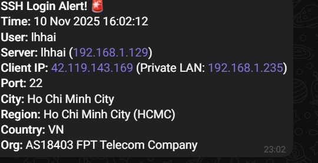

## bước 1 tạo bot tele
- tìm `botFather` 
- sau đó nhập lệnh `/start` để tạo bot mới 

  
- nhập lệnh `/newbot` và tên bot
## bước 2 lấy id của bot và token 
- vào `IDBot` nhập lệnh `/getid` để lấy id 
- vào `botFather` nhập `/mybots` để lấy token 
## bước 3 tạo file script 
- `sudo nano /etc/profile.d/ssh-telegram.sh`
```
USERID="5317144337"
TOKEN="8272516289:AAGmBMSScPXHDZvEAMh0RFoam3DPDVqLMv0"
TIMEOUT="10"
URL="https://api.telegram.org/bot${TOKEN}/sendMessage"

# Thời gian hiện tại
DATE_EXEC="$(date '+%d %b %Y %H:%M:%S')"
TMPFILE='/tmp/ipinfo.txt'

# Hàm kiểm tra IP private
is_private_ip() {
    [[ $1 =~ ^10\. ]] || [[ $1 =~ ^192\.168\. ]] || [[ $1 =~ ^172\.(1[6-9]|2[0-9]|3[0-1])\. ]]
}

if [ -n "$SSH_CLIENT" ]; then
    IP=$(echo $SSH_CLIENT | awk '{print $1}')
    PORT=$(echo $SSH_CLIENT | awk '{print $3}')
    HOSTNAME=$(hostname -f)
    IPADDR=$(echo $SSH_CONNECTION | awk '{print $3}')

    # Nếu IP private thì lấy IP public thay thế
    if is_private_ip "$IP"; then
        PUBLIC_IP=$(curl -s https://ipinfo.io/ip)
        LOOKUP_IP=$PUBLIC_IP
        PRIVATE_NOTE="(Private LAN: $IP)"
    else
        LOOKUP_IP=$IP
        PRIVATE_NOTE=""
    fi

    # Gọi ipinfo.io để lấy thông tin
    curl -s "http://ipinfo.io/${LOOKUP_IP}" -o "${TMPFILE}"
  CITY=$(jq -r '.city' "${TMPFILE}")
    REGION=$(jq -r '.region' "${TMPFILE}")
    COUNTRY=$(jq -r '.country' "${TMPFILE}")
    ORG=$(jq -r '.org' "${TMPFILE}")

    # Nếu ipinfo trả về rỗng thì gán "Unknown"
    [ "$CITY" == "null" ] && CITY="Unknown"
    [ "$REGION" == "null" ] && REGION="Unknown"
    [ "$COUNTRY" == "null" ] && COUNTRY="Unknown"
    [ "$ORG" == "null" ] && ORG="Unknown"

    TEXT=" *SSH Login Alert!* %0A\
 *Time:* ${DATE_EXEC}%0A\
 *User:* ${USER}%0A\
 *Server:* ${HOSTNAME} (${IPADDR})%0A\
 *Client IP:* ${LOOKUP_IP} ${PRIVATE_NOTE}%0A\
 *Port:* ${PORT}%0A\
 *City:* ${CITY}%0A\
 *Region:* ${REGION}%0A\
 *Country:* ${COUNTRY}%0A\
 *Org:* ${ORG}"

    curl -s -X POST --max-time ${TIMEOUT} "${URL}" \
        -d chat_id="${USERID}" \
        -d text="${TEXT}" \
        -d parse_mode="Markdown" > /dev/null

    rm -f "${TMPFILE}"
fi

```
- `USERID` là idbot của tele
- `TOKEN` là BOT token lấy từ `botFather`
- `timeout` là thời gian tối da chờ phản hồi từ request 
- `DATA_EXEC` thời gian hiện tại 
- `if [ -n "$SSH_CLIENT" ]; then` 
- `$SSH` là biến môi trường SSH tự động thiết lập khi user kết nối 
- ` awk '{print $1}'` là ip client 
- ` awk '{print $3}'` là port của client 
- `SERVER_IP=$(echo "$SSH_CONNECTION" | awk '{print $3}')`
  - ` awk '{print $3}'` là ip server mà client kết nối 
- ` IPINFO=$(curl -s "http://ipinfo.io/$CLIENT_IP/json")`  để lấy thông  tin json của ip client 
```
 if [[ "$CLIENT_IP" =~ ^10\.|^192\.168\.|^172\.(1[6-9]|2[0-9]|3[0-1])\. ]]; then
        CITY="Unknown"
        REGION="Unknown"
        COUNTRY="Unknown"
        ORG="Local Network"
    else
        CITY=$(echo "$IPINFO" | jq -r '.city // "Unknown"')
        REGION=$(echo "$IPINFO" | jq -r '.region // "Unknown"')
        COUNTRY=$(echo "$IPINFO" | jq -r '.country // "Unknown"')
        ORG=$(echo "$IPINFO" | jq -r '.org // "Unknown"')
    fi
 ```

- nếu là ip private thì không tra cứu được thông tin từ ipinfo.io và gán unknow 
- nếu là ip public sẽ hiện ra đầy đủ thông tin 
```
 curl -s -X POST --max-time "$TIMEOUT" "$URL" \
        -d "chat_id=$USERID" \
        -d text="$TEXT" > /dev/null
```
- `-X PORT` gửi Port request 
- `--max-time "$TIMEOUT" ` giới hạn thời gian chờ phản hồi 
- `-d "chat_id=$USERID"` gửi tới user cụ thể 
- `  -d text="$TEXT" ` nội dung thông báo 

## 4 kết quả khi máy khác ssh vào 


     
 


