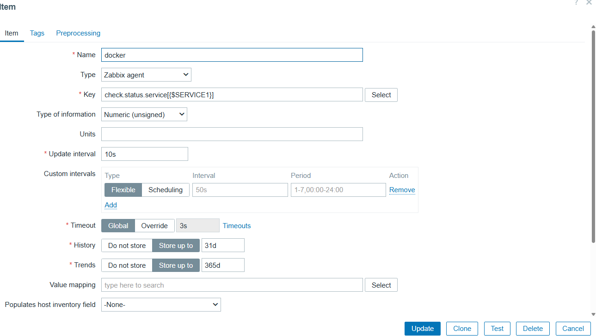
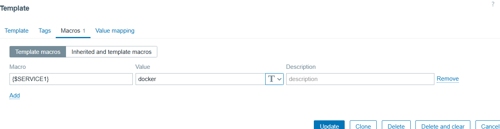
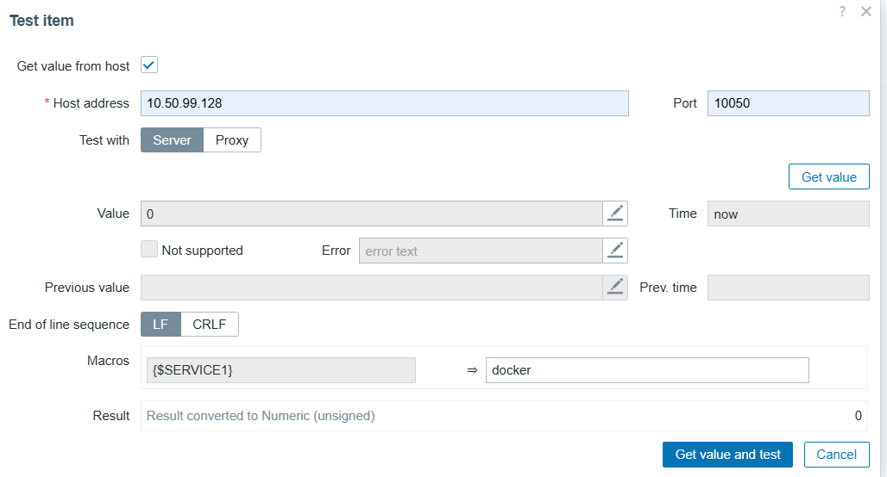
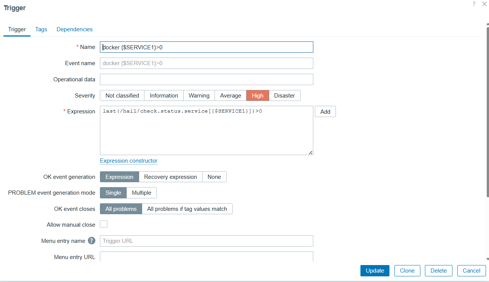

# viết exit code để check status của service treen zabbix
## 1. tạo file cấu hình exit code 
- `sudo nano /opt/check_exit_code.sh`
```
SERVICE=$1
sudo systemctl is-active "$SERVICE" --quiet
echo $?
```
## 2.tạo file cấu hình userparameter 
- ` sudo nano /etc/zabbix/zabbix_agentd.d/check.status.conf`

`UserParameter=check.status.service[*], /bin/bash /opt/check_exit_code.sh $1`
  - `check.status.service[*]` là cái key để zabbix server gọi vào để lấy dữ liệu 
  - `/bin/bash /opt/check_exit_code.sh $1` khi zabbix gọi key này thì aggent sẽ thực thi lệnh 

## 3. tạo item 

  

- nhập tên của item 
- nhập key mà mình đã cấu hình trong userparameter và nhập biến mà mình đã tạo trong macros

   

- sau đó nhấn test để kiểm tra 



- test value trả về 0 nghĩa là service đấy đang chạy bình thường 

## 4. tạo trigger 



- nhập tên trigger 
- `Severity` chọn mức độ cảnh báo 
- viết `Expression` để cảnh báo 
- `last(/hai1/check.status.service[{$SERVICE1}])>0` nếu service trả về là 0 sevice đang hoạt động . còn service trả về > 0 nghĩa là service không hoạt động 


