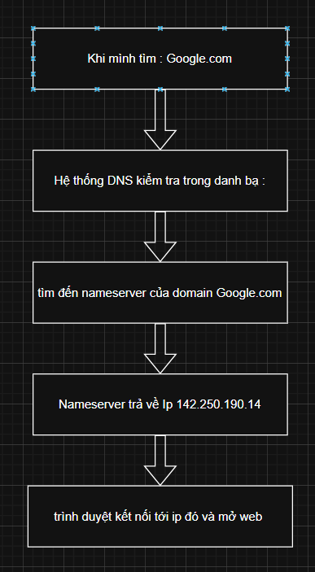

#  tìm hiểu về DNS , Domain , Nameserver
## 1. DNS

là hệ thống phân giải tên miền thành địa chỉ ip 
- ví dụ

 khi mình gõ google.com vào trình duyệt 

 trình duyệt sẽ hỏi DNS server " google.com" có ip là gì 

 DNS trả lời "142.250.190.14"

 trình duyệt dùng ip đó để kết nối tới server của google 

## 2. domain 

là tên dễ nhớ mà người dùng gõ vào trình duyệt để truy cập web 

- ví dụ 

thay vì phải nhớ địa chỉ ip (142.250.190.14) thì mình chỉ cần nhớ google.com

## 3. nameserver 

máy chủ chịu trách nhiệm trả lời yêu cầu của DNS cho 1 domain cụ thể 

## 4. cách chúng hoạt động cùng nhau 

   

## 5. cài đặt cấu hình DNS

`sudo apt-get install Bind9` 

`vi /etc/bind/named.conf.local`  cấu hình cho domain 

  

 tạo tệp vùng : tệp vùng này chứa các bản ghi DNS cho một tên miền cụ thể 
 ` sudo nano /etc/bind/db.hailh.local`
    
  

khởi động lại bind 

`sudo systemctl restart bind9`

kiểm tra cấu hình DNS 
`dig @localhost hailh.local`

sao lưu lại tệp vùng DNS để tránh mất dữ liệu khi hệ thống gặp sự cố
` sudo cp /etc/bind/db.hailh.local /backup/db.hailh.local.bak`

