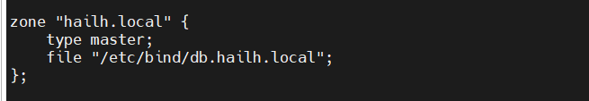

#  tìm hiểu về DNS , Domain , Nameserver
## 1. DNS

là hệ thống phân giải tên miền thành địa chỉ ip 
- ví dụ

 khi mình gõ google.com vào trình duyệt 

 trình duyệt sẽ hỏi DNS server " google.com" có ip là gì 

 DNS trả lời "142.250.190.14"

 trình duyệt dùng ip đó để kết nối tới server của google 

## 2. domain 

là tên dễ nhớ mà người dùng gõ vào trình duyệt để truy cập web 

- ví dụ 

thay vì phải nhớ địa chỉ ip (142.250.190.14) thì mình chỉ cần nhớ google.com

## 3. nameserver 

máy chủ chịu trách nhiệm trả lời yêu cầu của DNS cho 1 domain cụ thể 

## 4. cách chúng hoạt động cùng nhau 

   

## 5. các loại DNS record
- A Record : trỏ 1 tên miền đến địa chỉ IPv4
- AAA Record : trỏ 1 tên miền đến địa chỉ IPv6
- CNAME : tạo bí danh (alias) cho 1 tên miền trỏ đến tên miền khác . tuy nhiên mình không thể đặt bản ghi CNAME vào tên miền gốc , bản ghi CNAME phải luôn trỏ đến tên miền khác chứ không phải là 1 địa chỉ ip 
- MX Record : xác định máy chủ email xử lý thư gửi đến tên miền . dùng khi thiết lập email cho domain , có trọng số để ưu tiên máy chủ nào nhận email trước 
- TXT Record : lưu văn bản tùy ý . thường dùng để xác thực domain , thiết lập email (SPF, DKIM, DMARC)
 
      SPF : chống giả mạo email
      DKIM : ký email bằng chữ ký số 
      DMARC : chính sách xử lý nếu SPF/DMARC không Khớp 
- NS Record : dùng để chỉ định máy chủ DNS nào có thẩm quyền quản lý và trả lời truy vấn DNS cho 1 domain cụ thể 
- các NS hoạt động 
     khi mình gõ google.com vào trình duyệt:
     hệ thống sẽ truy vấn bản ghi NS của domain để biết DNS sever nào đang quản lý 
     trình phân giải DNS sẽ truy vấn đến DNS serevr đó để lấy các bản ghi như A MX TXT 
     sau đó mới lấy được ip hoặc thông tin cần thiết để truy cập website , gửi email
- SOA : bản ghi bắt buộc cho DNS ZONE - chứa thông tin : quản trị viên , serial , thời gian cập nhật 
- PTR : 

## 6. cài đặt cấu hình DNS

`sudo apt-get install Bind9` 

`vi /etc/bind/named.conf.local`  cấu hình cho domain 

  

 tạo tệp vùng : tệp vùng này chứa các bản ghi DNS cho một tên miền cụ thể 
 ` sudo nano /etc/bind/db.hailh.local`
    
  

khởi động lại bind 

`sudo systemctl restart bind9`

kiểm tra cấu hình DNS 
`dig @localhost hailh.local`

sao lưu lại tệp vùng DNS để tránh mất dữ liệu khi hệ thống gặp sự cố
` sudo cp /etc/bind/db.hailh.local /backup/db.hailh.local.bak`

