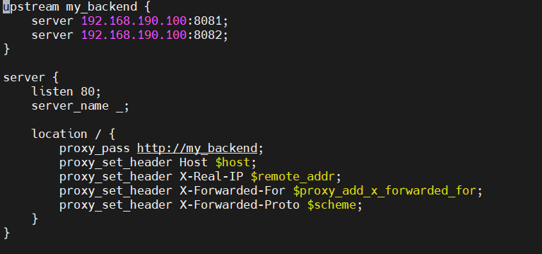
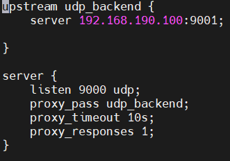

# 1 . cấu hình loadbalancer cho http và  reverse proxy
- tạo file cấu hình
- ` sudo nano /etc/nginx/conf.d/loadbalancer.conf`

- upstream my_backend {

    server 192.168.190.100:8081;

    server 192.168.190.100:8082;

    }

- đây là block upstream dùng để định nghĩa các backend server
- nginx sử dụng round -robin để phân phối request đến các back end 
- `proxy_pass http://my_backend;`  lệnh này nằm trong block location . NGINX gửi request đến upstream . NGINX nhận request từ client rồi thay mặt client gửi đến backend
- `proxy_set_header Host $host;` giữ lại tên gốc từ client 
- `proxy_set_header X-Real-IP $remote_addr;` gửi địa chỉ ip thực của client 
- ` proxy_set_header X-Forwarded-For $proxy_add_x_forwarded_for;`gửi chuỗi ip qua các proxy trung gian
- ` proxy_set_header X-Forwarded-Proto $scheme;`gửi scheme (http hoặc https) của request gốc 
- kiểm tra xem cấu hình nginx có lỗi không
- `sudo nginx -t`
- sau đó reload nginx
- `sudo systemctl reload nginx`

# 2. cấu hình loadbanlancer cho udp 
- vào file cấu hình 
- `sudo nano /etc/nginx/nginx.conf`
- thêm  block stream vào file `nginx.conf`
`stream {include /etc/nginx/stream.d/*.conf;}` 
- rồi mình tạo folder 
-`sudo mkdir -p /etc/nginx/stream.d`
- tạo file cấu hình 
- `sudo nano /etc/nginx/stream.d/udp-loadbalancer.conf`

     

- kiểm tra xem cấu hình nginx có lỗi không
- `sudo nginx -t`
- sau đó reload nginx
- `sudo systemctl reload nginx`
- test 
- `nc -u -l 9001` nc(netcat) sẽ mở cổng 9001/udp và chờ nhận dữ liệu 
- `echo "nginx test" | nc -u -v 192.168.190.100 9000` 
- bên backend (port:9001) sẽ được in ra `nginx test`

