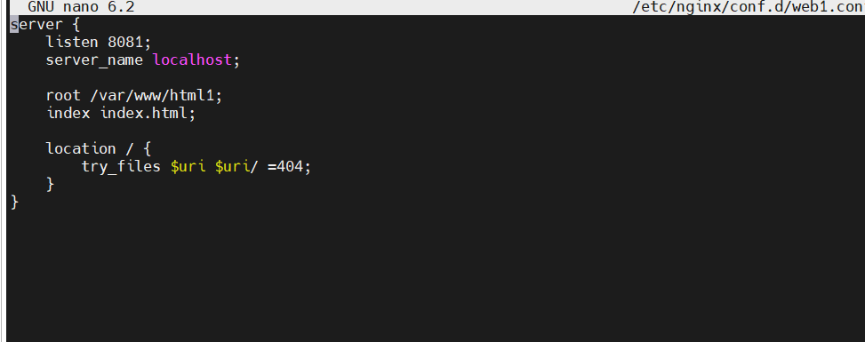
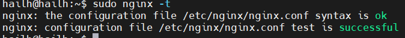

# 1. dựng 1 static web dùng html với nginx loadbalancer + rev proxy

- cài đặt nginx 
- `sudo apt install nginx ` 
- tạo thư mục cho web tĩnh 
- `sudo mkdir -p /var/www/html1/index.html`
- cấu hình nginx cho website
- tạo file cấu hình 
  ` sudo nano /etc/nginx/conf.d/web1.conf`

  

- kích hoạt website 
- `sudo ln -s /etc/nginx/conf.d/web1.conf /etc/nginx/sites-enabled/web1.conf`
- kiểm tra xem cấu hình nginx có lỗi không
- `sudo nginx -t`

  
- sau đó reload nginx
- `sudo systemctl reload nginx`
- truy cập website 
 `http:// 192.168.190.100 `

 

