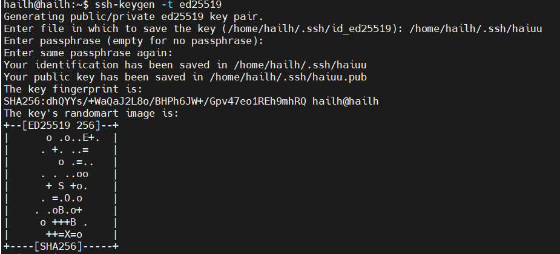
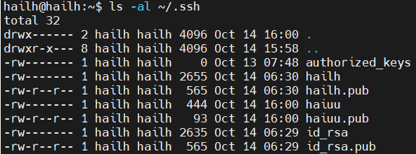

# SSH
1. SSH Key là gì 
- SSH Key là một cặp khóa mật mã được sử dụng để xác thực an toàn khi kết nối tới một máy chủ từ xa qua giao thức SSH (Secure Shell) thay cho việc dùng mật khẩu.
- SSH key gồm 2 phần :
- private key : giữ bí mật chỉ lưu trữ trên máy của mình không được chia sẻ 
- public key : có thể chia sẻ với máy chủ từ xa 
2. lợi ích sử dụng ssh key 
- Tăng Cường Bảo Mật: SSH keys loại bỏ nguy cơ bị đánh cắp mật khẩu thông qua việc nghe lén hoặc tấn công thử mật khẩu như brute-force và các thử nghiệm phishing, vì chúng yêu cầu quyền truy cập vào khóa riêng tư.
- Tiện Lợi: Sau khi cấu hình, SSH keys cho phép xác thực không cần mật khẩu, giúp việc truy cập vào nhiều máy chủ trở nên dễ dàng hơn. 
- khả Năng Mở Rộng: Chúng đặc biệt hữu ích trong môi trường có nhiều máy chủ

bước 1. `ssh-keygen -t ed25519` tạo ssh key
- `ed25519` là một loại thuật toán mã hóa khóa công khai hiện đại , nhanh hơn, nhỏ hơn và bảo mật tốt hơn
2. `Enter file in which to save the key (/home/hailh/.ssh/id_ed25519): ` chọn nơi lưu key
3. `Enter passphrase (empty for no passphrase):` nhập mật khẩu 

- `haiuu` private key 
- `haiuu.pub` public key

4. `ls -al ~/.ssh` kiểm tra xem đã tạo thành công chưa 

