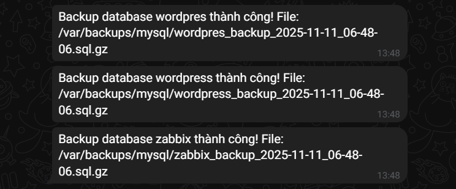

# script backup database set crontab chạy backup mỗi ngày vào lúc 2h sáng
## bước 1 cài đặt crontab
- `sudo apt update` 
- `sudo apt install cron`
## bước 2 tạo file script 
- `sudo nano /usr/local/bin/backup_mysql.sh`
```
#!/bin/bash

# Cấu hình
DB_USER="zabbix"
DB_PASS="password123"
BACKUP_DIR="/var/backups/mysql"
LOG_FILE="/var/log/backup_mysql.log"
DATE=$(date +"%Y-%m-%d_%H-%M-%S")

TELEGRAM_BOT_TOKEN="8272516289:..."
TELEGRAM_CHAT_ID="5317144337"

mkdir -p $BACKUP_DIR

get_databases() {
    mysql -u $DB_USER -p$DB_PASS -e "SHOW DATABASES;" | grep -Ev "(Database|information_schema|performance_schema|mysql|sys)"
}

backup_database() {
    local DB_NAME=$1
    local BACKUP_FILE="$BACKUP_DIR/${DB_NAME}_backup_${DATE}.sql.gz"
    
    if mysqldump -u $DB_USER -p$DB_PASS $DB_NAME | gzip > $BACKUP_FILE; then
        find $BACKUP_DIR -type f -name "${DB_NAME}_backup_*.sql.gz" -mtime +7 -delete
        echo "$BACKUP_FILE"
        return 0
    else
        return 1
    fi
}

send_telegram() {
    local MESSAGE="$1"
    echo "$(date '+%Y-%m-%d %H:%M:%S') - $MESSAGE" >> $LOG_FILE
    curl -s -X POST "https://api.telegram.org/bot$TELEGRAM_BOT_TOKEN/sendMessage" \
        -d chat_id="$TELEGRAM_CHAT_ID" \
        -d text="$MESSAGE"
}

DATABASES=$(get_databases)
for DB_NAME in $DATABASES; do
    if BACKUP_FILE=$(backup_database $DB_NAME); then
        MESSAGE="Backup database $DB_NAME thành công! File: $BACKUP_FILE"
    else
        MESSAGE="Backup database $DB_NAME thất bại!"
    fi
    send_telegram "$MESSAGE"
done


```
- `BACKUP_DIR` là thư mục chứa file backup
- `LOG_FILE` file ghi log lại kết quả backup
- `mkdir -p` tạo thư mục nếu chưa tồn tại, tránh lỗi khi script chạy.
- `DATABASES=$(mysql -u $DB_USER -p$DB_PASS -e "SHOW DATABASES;" | grep -Ev "(Database|information_schema|performance_schema|mysql|sys)")`
- `mysql -u $DB_USER -p$DB_PASS -e "SHOW DATABASES;" ` liệt kê tất cả database
- `grep -Ev ` loại bỏ các database hệ thống không cần backup
- `for DB_NAME in $DATABASES` lặp qua từng database
- ` BACKUP_FILE` tên file backup 
- ` if mysqldump -u $DB_USER -p$DB_PASS $DB_NAME | gzip > $BACKUP_FILE; then`
- dump database mysql, nén file bằng gzip , lưu vào thư mục backup 
- `echo "$(date '+%Y-%m-%d %H:%M:%S') - $MESSAGE" >> $LOG_FILE` ghi thông báo vào file log
- `curl -s -X POST` gửi thông báo đến tele 
- ## bước 3 set crontab chạy backup vào mỗi 2h sáng 
- `crontab -e` 
- `0 2 * * * /usr/local/bin/backup_mysql.sh >> /var/log/backup_mysql.log 2>&1`
## bước 4 test 
- `sudo /usr/local/bin/backup_mysql.sh`

 


 


