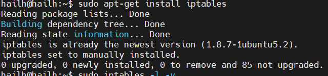
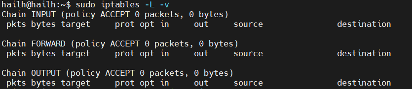
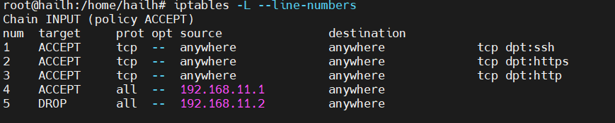
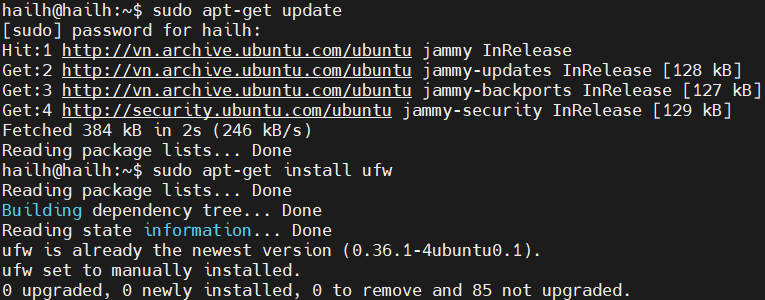
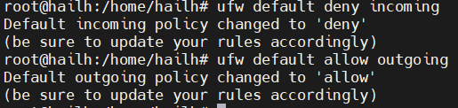
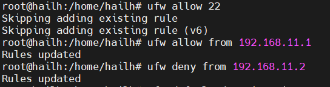

# 1 firewall
- Firewall là một hệ thống dùng để kiểm soát lưu lượng mạng ra vào hệ thống theo một tập hợp các quy tắc được cấu hình sẵn. Nó hoạt động như một rào chắn bảo vệ, cho phép hoặc chặn các kết nối mạng dựa trên: Địa chỉ IP nguồn/đích , Cổng (Port) ,Giao thức (TCP, UDP,...), Ứng dụng ,Trạng thái kết nối
1.  Mục đích của Firewall trong Linux
- bảo vệ hệ thống khỏi các tấn cống mạng : chặn truy cập trái phép , ngăn các cuộc tấn công như DDOS , brute force 
- giới hạn truy cập : chỉ cho phép các dịch vụ cụ thể hoạt động trên các cổng nhất định
- lọc lưu lượng : kiểm tra và lọc gói tin mạng 
- giám sát lưu lượng : ghi log các kết nối đến và đi giúp mình phát hiện được bất thường 
# 2 Iptables 
- iptables là một công cụ tường lửa mạnh mẽ trên linux được sử dụng để quản lý và kiểm soát luông dữ liệu mạng . iptables hoạt động bằng cách kiểm tra các gói tin(packet) đi qua máy chủ và áp dụng các luật(rule) đã được thiết lập để quyết định xem gói tin đó có được chấp nhận(accept) , loại bỏ(drop) hay từ chối(reject)
1. iptables dùng để làm gì 
- kiểm soát truy cập mạng(access control): cho phép mình quyết định port nào được mở , địa chỉ ip nào được kết nối với dịch vụ nào giúp kiểm soát truy cập mạng một cách chi tiết 
- lọc gói tin : đây là chức năng cơ bản nhất của mọi linux firewall . iptables có thể chặn các gói tin dựa trên nhiều tiêu chí : ip nguồn, đích , port , giao thức (tp,udp) hay thậm chí là trạng thái kết nối
- ngăn chặn tấn công mạng : bằng cách thiết lập các rule thông minh , iptables giúp sever chống lại các cuộc tấn công DDOS , brute force và quét port từ bên ngoài 
- chức năng NAT/Routing : iptables không chỉ dừng lại ở việc lọc mà còn hỗ trợ các tác vụ định tuyến phức tạp 
- => chức năng của iptables là tạo 1 lớp bảo vệ vững chắc , giảm thiểu bề mặt tấn công máy chủ và đảm bảo chỉ có lưu lượng truy cập hợp lệ mới xử lý được
2. cấu trúc iptables 
- các thành phần chính iptables : tables (bảng) , chains(chuỗi) targets(mục tiêu)

- table trong iptables:
- filter table : bảng được sử dụng phổ biến nhất trong iptables . nó quyết định xem một gói tin có được phép đi qua hay bị từ chối 
- NAT table : dùng để thay đổi địa chỉ ip của gói tin , thường dùng trong các tình huống NAT như khi bạn cần chuyển hướng hoặc đổi địa chỉ ip nguồn hoặc đích 
- Mangle table : dùng để chỉnh sửa các thông tin của gói tin 
- Raw table : giúp bạn xử lý gói tin trước khi hệ thống bắt đầu kiểm tra trạng thái của kết nối . điều này giúp tối ưu hiệu suất và loại bỏ các gói tin không cần thiết 

- chains trong iptables 
- chains là các chuỗi quy tắc mà bạn sẽ áp dụng vào các gói tin để quyết định xem chúng có được phép đi qua hay không . mỗi chains tương ứng với 1 loại hành động cụ thể và được áp dụng trong từng bảng riêng biệt 
- chain PREROUTING : chuỗi này có mặt trong các bảng NAT , MANGLE , RAW . các quy tắc trong PREROUTING sẽ được thực thi ngay khi một gói tin đến giao diện mạng . đây là bước đầu tiên xử lý gói tin 
- chain INPUT : bult-in chain của bảng filter. NAT không có chain INPUT ; NAT có PREROUTING , POSTROUTING , OUTPUT
- chain OUTPUT : được tìm thấy trong các bảng RAW , MANGLE và FILTER . quy tắc trong output được áp dụng sau khi gói tin được tạo ra bởi một tiến trình trên hệ thống trước khi nó rời khỏi máy 
- chain forward : có trong mangle và filter , chuỗi này áp dụng các gói tin được định tuyến qua hệ thống mà không đến máy chủ đó trực tiếp 
- chain POSTROUTING : chuỗi này chỉ có trong các bảng mangle và NAT . các quy tắc trong POSTROUTING sẽ được áp dụng khi gói tin rời khỏi giao diện mạng , túc là trước khi rời khỏi hệ thống

- target trong tables 
- target là hành động được thục hiện đối với các gói tin nếu chúng đáp ứng các quy tắc đã định sẵn . các target trong table sẽ quyết định liệu 1 gói tin có được chấp nhận , từ chối ghi log hay làm gì khác 
- accept target : chấp nhận cho phép gói tin đi vào hệ thống . nếu không có rule nào khớp , hành dộng sẽ theo policy mặc định của chain 
- drop target : loại bỏ gói tin mà không trả lời gì về nó . gói tin bị loại sẽ không nhận được bất kỳ phản hồi nào 
- reject target : loại bỏ gói tin nhưng trả lại một thông điệp để cho người gửi biết gói tin bị từ chối 
- log target : cho phép gói tin đi qua nhưng sẽ ghi lại thông tin của gói tin vào trong log để mình có thể kiểm tra sau 
 3. các tùy chọn thông số iptables 
 - `-t` chỉ định tên bảng 
 - `-p` chỉ định giao thức 
 - `-i` chỉ định giao diện mạng vào 
 - `-o` chỉ định giao diện mạng ra 
 - `-s` chỉ định địa chỉ ip nguồn
 - `-d` chỉ định địa chỉ ip đích 
 - `-v` hiển thị thông tin chi tiết các quy tắc 
 - `-sport` chỉ định cổng nguồn 
 - `-dport` chỉ định cổng đích 
 - `--line-numbers` hiển thị các số thứ tự của quy tắc trong mỗi chain

 - các tùy chọn để thao tác chain trong iptables 
 - `iptables -N` tạo 1 chuỗi mới 
 - `iptables -X` xóa 1 chuỗi 
 - `iptables -P` đặt chinh sách cho chuỗi bult-in(như INPUT, FORWARD, OUPUT)
 - `iptables -L` liệt kê các quy tắc trong một chuỗi 
 - `iptables -F` xóa tất cả các quy tắc trong một chuỗi
 - `iptables -X` reset bộ đệm gói tin về không

-  các tùy chọn để thao tác các rule
- `-A` thêm 1 quy tắc vào cuối chuỗi 
- `-D` xóa một quy tắc 
- `-R` thay thế một quy tắc 
- `-I` chèn một quy tắc vào đầu chuỗi  
4. cài đặt iptables và thiết lập các quy tắc 
- cài đặt iptables 
- `sudo apt-get update`
- `sudo apt-get install iptables`

  

- `sudo iptables -L -v` dùng để kiểm tra trang thái hiện tại của iptables

  

- thiết lập quy tắc 

- `sudo iptables -A INPUT -p tcp --dport 22 -j ACCEPT`
- `sudo iptables -A INPUT -p tcp --dport 80 -j ACCEPT`
- `sudo iptables -A INPUT -p tcp --dport 443 -j ACCEPT`
- các lệnh này cho phép truy cập vào các cổng (22)ssh , (80)http , (443)https từ bất kỳ ip nguồn nào 
- `sudo iptables -A INPUT -s 192.168.11.1 -j ACCEPT` 
- lệnh này cho phép các gói tin từ địa chi ip nguồn 192.168.11.1 sẽ được chấp nhận
- `iptables -A INPUT -s 192.168.11.2 -j DROP` các gói tin từ địa chỉ ip nguồn 192.168.11.2 sẽ bị từ chối

  

  `sudo bash -c 'iptables-save > /etc/iptables/rules.v4'` để lưu lại rule  để khi reboot sẽ ko bị mất rule

# 3. UFW
- UFW là giao diện dòng lệnh giúp quản lý iptables với các câu lệnh ngắn gọn , dễ nhớ hơn.
- mục đích UFW 
- bảo vệ máy chủ khỏi truy cập trái phép 
- cho phép hoặc chặn truy cập các cổng mạng (SSH, HTTP, HTTPS)
- quản lý dễ dàng các luật firewall 
1. cài đặt UFW 
- `sudo apt-get update`
- `sudo apt-get install ufw`

  

- `sudo ufw status` nếu như kết quả trả về là `active` thì `sudo ufw disable` để tắt tạm thời ufw
- `sudo ufw default deny incoming` từ chối tất cả các kết nối từ bên ngoài truy cập vào máy chủ 
- `sudo ufw default allow outgoing` cho phép kết nối từ máy chủ ra bên ngoài 

  

- `systemctl start ufw` kích hoạt ufw
- `sudo ufw allow 22` cho phép truy cập qua công 22 
- `sudo ufw allow from 192.168.11.1` cho phép kết nối vào máy chủ theo địa chỉ ip
- ` sudo ufw deny from 192.168.11.2` chặn toàn bộ lưu lượng từ địa chỉ ip

  

- `sudo ufw delete 2` xóa kết nối theo số thứ tự `sudo ufw delete allow http/80` xóa kết nối theo tên hoặc port
- `sudo ufw status numbered` liệt kê tất cả các quy tắc tường lửa hiện tại 

