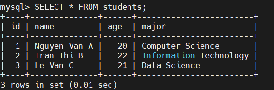
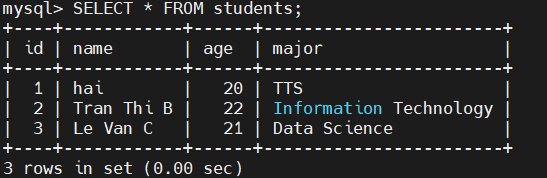

## 1. tạo database 
- `CREATE DATABASE hai06;` 
## 2. tạo USER 
- `CREATE USER 'hai06'@'localhost' IDENTIFIED BY 'hai061205';`
## 3. cấp quyền cho USER 
- `GRANT ALL PRIVILEGES ON hai06* TO 'hai06'@'localhost';` lệnh này cấp FULL quyền cho user `hai06` cho database `hai06`
- `EXIT:` để thoát ra 
- `mysql -u hai06 -p ` để đăng nhập vào user `hai06`
- `USE hai06` truy cập vào database

  CREATE TABLE students (  
    id INT AUTO_INCREMENT PRIMARY KEY,   
    name VARCHAR(100),  
    age INT,   
    major VARCHAR(100)   
    );

- lệnh trên bảng students vs 4 cột
- id : khóa chính tự động tăng 
- name : tên sinh viên 
- age : tuổi 
- major : chuyên ngành 

- ` INSERT INTO students (name, age, major) VALUES` thêm dữ liệu vào bảng 
- ` SELECT * FROM students;` xem dữ liệu trong bảng 

  

- do user `hai06` được cấp FULL quyền nên ta có thể chỉnh sửa dữ liệu trong tables
 
     `UPDATE students` 

     `SET name = 'hai', major = 'TTS'`

     `WHERE id = 1;`

- `SELECT * FROM students;` để xem dữ liệu đã được chỉnh sửa trong bảng 

  

- bây giờ mình xem tạo 1 USER khác và gán quyền USER đó cho database `hai06` để test 
- `CREATE USER 'hailh'@'localhost' IDENTIFIED BY 'hai061205';` 
- `GRANT CREATE ON hai06.* TO 'hailh'@'localhost';` cấp quyền tạo tables cho user `hailh` trong database `hai06`

  CREATE TABLE xyz (     
    id INT AUTO_INCREMENT PRIMARY KEY,     
    name VARCHAR(100),     
    age INT,     
    major VARCHAR(100) 
    );

    
- đã tạo bảng thành công
- `INSERT INTO xyz (name, age, major) VALUES ('ho', 20, 'Computer Science'), ('ha', 22, 'Information Technology'), ('hi', 21, 'Data Science');`

    
- báo lỗi do USER `hailh` chỉ được cấp quyền CREATE chứ không được cấp quyền INSERT trong database `hai06` 
 

