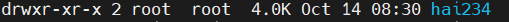
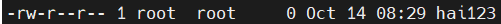

# Linux 
## Basic commands 

- `pwd` dùng để hiển thị thư mục mà mình đang ở 
- `ls` dùng để hiển thị tất cả các tệp và thư mục trong thư mục hiện tại 
- `cd` dùng để điều hướng từ thư mục này sang thư mục khác 
- `mv` dùng để đi chuyển hoặc đổi tên tệp và thư mục 
- `/` thư mục gốc cấp cao nhất của hệ thống tập tin 
- `/home` chưa dữ liệu người dùng và các tệp cấu hình dành riêng cho người dùng 
- `/bin` chứa các tệp thực thi của nhiều lệnh shell cơ bản như ls , cp , cd 
- `/sbin` chứa tệp nhị phân chỉ có thể được chạy bởi root hoặc người dùng sudo
- `/etc` chứa các tệp cấu hình cốt lõi của hệ thống 
- `/var` là nơi các chương trình lưu trữ thông tin thời gian chạy như ghi nhật ký hệ thống , theo dõi người dùng , bộ nhớ đệm và các tệp khác mà chương trình hệ thống tạo và quản lý 
- `/usr` chứa tất cả các tệp thực thi , thư viện , mã nguồn của hầu hết các chương trình hệ thống 
- `/lib` chứa các thư viện cần thiết cho các tệp nhị phân trong thư mục /bin và /sbin
- `/tmp` tệp tạm thời  
- `/dev` thư mục này chỉ chứa các các tệp liên quan đến thiết bị 
- `/dev/null` có thể được gửi để hủy bất kỳ tệp hoặc chuỗi nào 
- `/dev/zero` chứa chuỗi vô hạn 0
- `/dev/ramdom` chứa 1 chuỗi vô hạn các giá trị ngẫu nhiên 
- `/boot` chứa các tập tin của kernel và ảnh khỏi động  cùng với LILO và GRUB
- `/proc` chứa thông tin về các tiến trình đang chạy và các tham số kernel
- `ll` dùng để hiển thị tất cả các tệp và thư mục trong thư mục hiện tại chi tiết 
- `mkdir <tên thư mục>` tạo thư mục mới 
- `touch <tên tập tin>` tạo tập tin mới 
- `rm <tên tập tin>` xóa tập tin
- `rm <tên tập tin> <tên tập tin>` xóa nhiều tập tin
- `rm /h/a/i <tên tập tin>` xóa tập tin theo đường dẫn 
- `rm -i` xóa  cần xác nhận 
- `rm -f` xóa không cần xác nhận 
- `cat` và `tail` mở tập tin
- `vi <tên file>` để soạn văn bản 
- `tar` các options 
- `-c` tạo file để nén 
- `-x` giải nén 
- `-v` hiển thị quá trình nén và giải nén dữ liệu ra màn hình 
- `-f` chỉ định nén thành file 
- `--wildcards` tìm và xuất file bất kỳ trong file nén 
- `rwx` các tệp có 3 loại quyền `r` là đọc `w` là ghi `x` là thực thi  3 quyền này được đại diện theo thứ tự : người dùng(user) nhóm(group) người dùng khác(other)

 | rwx: | rwx: | rwx: |
 | :---| :---| :---|
 | u: | g: | o: |

 - ví dụ 

 
 
 - d là 1 folder
 - `rwx` là quyền của user ; user có quyền r(đọc) , w(ghi) , x(thực thi)
 - `r-x` là quyền của Group ; Group có quyền r(đọc) , x(thực thi)
 - `r-x` là quyền của other ; other có quyền r(đọc) , x(thực thi)
 - `root` `root` là quyền của user owner và quyền của group owner

 

 - `-` là 1 file 
 - `rw-` là quyền của user ; user có quyền r(đọc) , w(ghi)
 - `r--` là quyền của Group ; Group có quyền r(đọc)
 - `r--` là quyền của other ; other có quyền r(đọc) 

