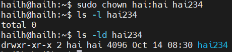
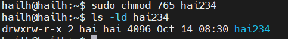

# file permision 
- file permision : xác định ai có thể làm gì với 1 tệp hoặc thư mục 
 - `rwx` các tệp có 3 loại quyền `r` là đọc `w` là ghi `x` là thực thi  3 quyền này được đại diện theo thứ tự : người dùng(user) nhóm(group) người dùng khác(other)

 - quyền đọc cho phép người dùng có thể xem nội dung của file với rất nhiều chương trình khác nhau nhưng họ sẽ không thể thay đổi sửa chữa hoặc xóa bất kỳ thông tin nào trong đó . họ có thể sao chép file đó thành file của họ và sửa chữa file bản sao

 - quyền ghi là truy nhập tiếp theo người sử dụng với quyền ghi khi truy nhập vào file có thể thêm thông tin vào file . nếu có quyền ghi và quyền đọc đối với 1 file có thể soạn thảo lại file đó - quyền đọc cho phép xem nội dung và quyền ghi cho phép thay đổi nội dung của file . nếu chỉ có quyền ghi , sẽ thêm được thông tin vào file , nhưng lại không thể xem được nội dung của file . 

 - quyền thực thi quyền này cho phép người dùng có thể chạy file nếu đó lầ chương trình khả thi 

  | rwx: | rwx: | rwx: |
 | :---| :---| :---|
 | u: | g: | o: |

  

 - `d` là 1 folder
 - `b` là file kiểu khối 
 - `c` là file kiểu ký tự 
 - `l` là liên kết tương trưng 
 - `p` dùng để giao tiếp giữa tiến trình 
 - `s` dùng cho giao tiếp mạng nội bộ giữa  tiến trình 
 - `rwx` là quyền của user ; user có quyền r(đọc) , w(ghi) , x(thực thi)
 - `r-x` là quyền của Group ; Group có quyền r(đọc) , x(thực thi)
 - `r-x` là quyền của other ; other có quyền r(đọc) , x(thực thi)
 - `root` `root` là quyền của user owner và quyền của group owner

- `chown` lệnh nayd dùng để đổi quyền sở hữu của người dùng và nhóm đối với tệp và thư mục 

  

- `chomd` lệnh này thay đổi quyền của tệp và thư mục 
- `0` không được cấp quyền 
- `1` quyền thực thi 
- `2` quyền viết 
- `3` quyền viết và thực thi 
- `4` quyền đọc 
- `5` quyền đọc , thực thi 
- `6` quyền đọc viết 
- `7` quyền đọc viết thực thi

  

- `765` là biểu diễn số của các quyền 
- `7` quyền đọc , viết và thực thi cho chủ sở hữu 
- `6` quyền đọc viết cho group
- `5` quyền đọc thực thi cho other 

