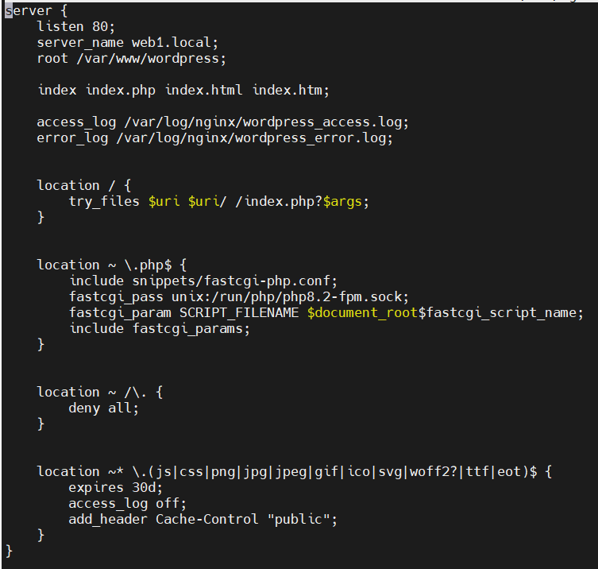
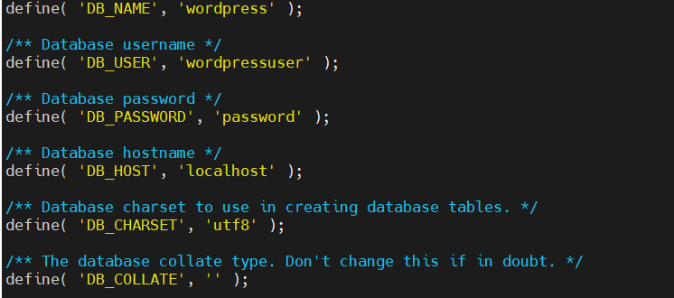
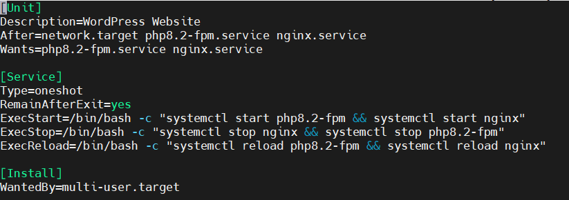
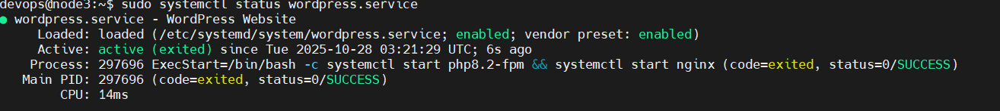

# 1. các bước setup
## bước 1. dùng mysql để tạo database và user cho wordpress 
- `sudo mysql` đăng nhập vào mysql
- tạo database cho wordpress
- `CREATE DATABASE wordpress DEFAULT CHARACTER SET utf8 COLLATE utf8_unicode_ci;`
- tạo user cho wordpress 
- `CREATE USER 'wordpressuser'@'localhost' IDENTIFIED BY 'password';`
- cấp quyền cho user 
- `GRANT ALL ON wordpress.* TO 'wordpressuser'@'localhost';` ALL là cấp Full quyền cho user
## bước 2. cài đặt tiện ích mở rộng PHP 
- `sudo apt install php8.2 php8.2-fpm php8.2-mysql -y`
## bước 3. cấu hình NGINX cho wordpress 
- `sudo nano /etc/nginx/sites-available/wordpress.conf `

     

## bước 4. cài đặt wordpress 
- tải về và giải nén 
- ` cd /tmp` chuyển thư mục của mình thành thư mục tạm thời
- `wget https://wordpress.org/latest.tar.gz` 
- `tar -xvzf latest.tar.gz` giải nén tệp
- `sudo mv wordpress /var/www/` 
- phân quyền 
- `sudo chown -R www-data:www-data /var/www/wordpress` 
- `sudo find /var/www/wordpress/ -type d -exec chmod 755 {} \;`
- `sudo find /var/www/wordpress/ -type f -exec chmod 644 {} \;`
- `find` dùng để tìm kiếm file/thư mục trong cây thư mục `/var/www/wordpress/`
- `type d ` chỉ tìm thư mục không tìm các file
- `-exec chmod 755 {} \;`  với mỗi thư mục tìm được thực thi lệnh `chmod 755` trên thư mục đó 
- `{}` là đại diện cho từng thư mục `find` tìm ra 
- `\;` ký hiệu kết thúc cấu lệnh `-exec` 
- `chomd` là lệnh thay đổi quyền truy cập cho file hoặc thư mục
- `7 rwx` cho chủ sở hữu : đọc, ghi , thực thi
- `5 r-x` cho group : đọc, thực thi 
- `5 r-x` cho other : đọc , thực thi
- tạo file cấu hình 
- ` cd /var/www/wordpress` 
- `cp wp-config-sample.php wp-config.php` 
- vào file cấu hình 
- `sudo nano /var/www/wordpress/wp-config.php`

   

- kiểm tra xem cấu hình nginx có lỗi không
- `sudo nginx -t`
- `sudo systemctl reload nginx` khởi động lại nginx 

  http://hai.local

# 2. viết wordpress chạy systemđ
## bước 1 tạo file systemd cho wordpress
- `sudo nano /etc/systemd/system/wordpress.service`
  
  

## bước 2 xem wordpress đã chạy systemd chưa

